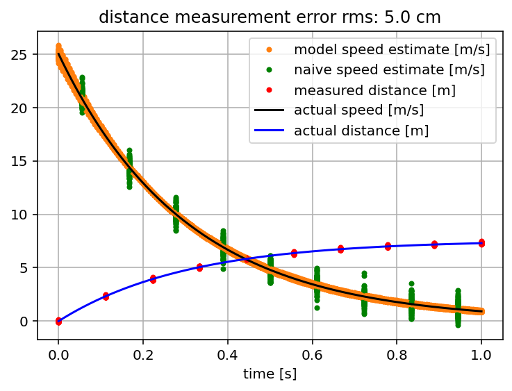

# speargundrag
This is a simple mathematical model, implemented in python, for how a speargun spear decelerates through the water. The model assumes the drag is proportional to the speed. This assumption gives a differential equation, the solution of which gives speed that decays exponentially over time. The code is equipped with the ability to estimate the model parameters, when given noisy (time, distance) measurements. Once the model parameters have been estimated, we can estimate the speed at any time.

The code includes a demo script that compares model-based speed estimates against naive speed estimates of the form: distance travelled / time interval. The naive estimates work well enough if the measurement errors are small. For larger measurement errors the model-based estimates are much more accurate. Another advantage is that the model can interpolate, or extrapolate speed estimates to times that were not actually measured. 

In the example shown below, we generate distance against time data, always from a model with the same fixed parameters, but for a 100 different runs, where each run has the same ground-truth speed and distance data, but with independent measurement errors. At the chosen error level (5cm distance rms measurement error) the model does quite a bit better than the naive speed estimates.    

